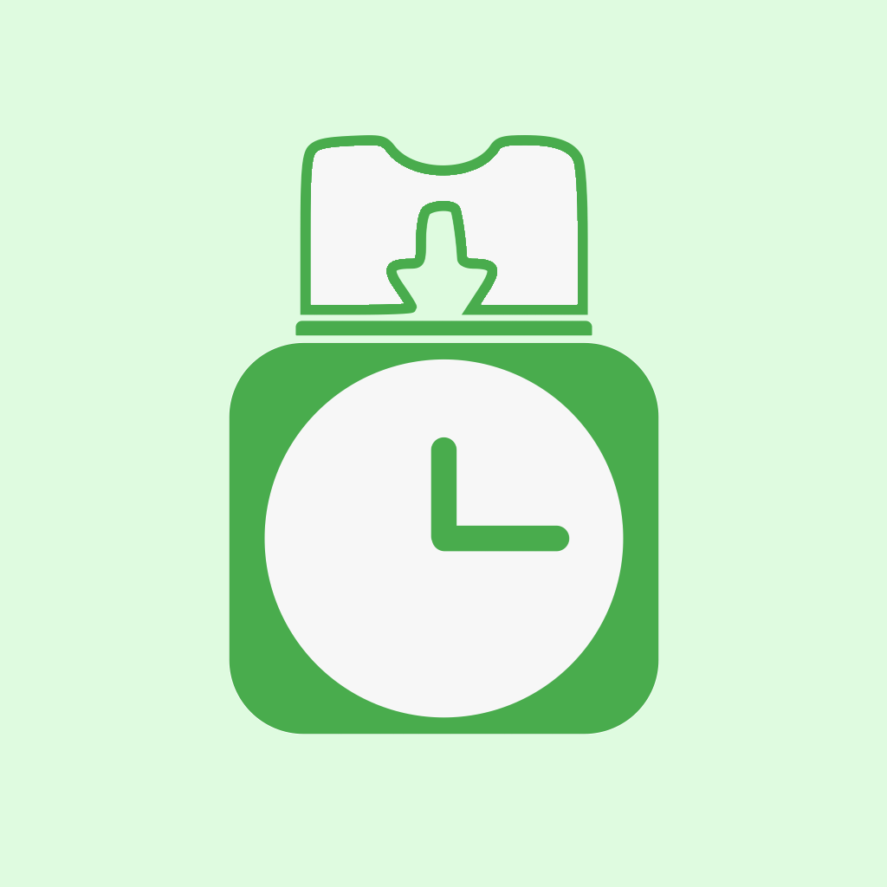

#  Work Clocker

***A KISS Time Card program***

[**Work Clocker**](https://github.com/Ribeiro-Tiago/work-clocker) is a "timecard punch" app to allow workers to better manage their time to 
avoid working more than the 8 hours they need to. Among other things, tells you when you can leave, taking into account the starting time, 
lunch duration and duration of a regular work day.

Planned features are listed in the[*TODO*](https://github.com/Ribeiro-Tiago/work-clocker/blob/master/TODO) file. Details on already implemented features are available in the [*CHANGELOG*](https://github.com/Ribeiro-Tiago/work-clocker/blob/master/CHANGELOG) file. 
If you have an idea that has not yet been proposed or rejected, feel free to [open a new issue](https://github.com/Ribeiro-Tiago/work-clocker/issues/new).

## Run locally

- Clone repo
- Install dependencies > ``npm run install ``
- To run on **browser** > ``ionic serve``
- To run on **android** device / emulator > ``ionic cordova run android``
- To run on **ios** device / emulator > ``ionic cordova run ios``

## How to contribute

Work Clocker is *your* timecard tracker. Because it is free software (GPL v3), you can contribute to make it better. 
New contributors are always welcome, whether you write code, create resources, report bugs, or suggest features.

This app is developed using the Ionic Framework (version 5)

Read [CONTRIBUTING](https://github.com/Ribeiro-Tiago/work-clocker/blob/master/CONTRIBUTING.md). and don’t hesitate!

## Credits
Flag icons by - https://www.flaticon.com/packs/international-flags